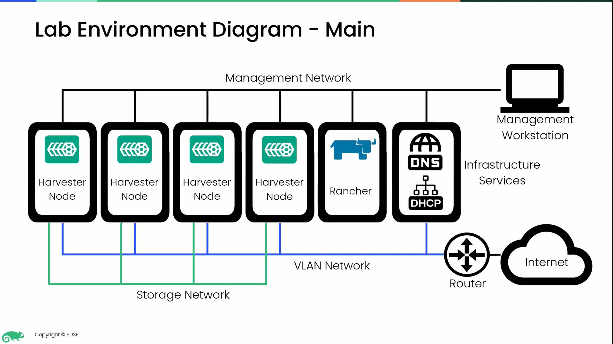

# eHRV101v1.2 - Introduction to SUSE Virtualization (Harvester) (Internal/Partner)

- https://suselearningcenter.litmoseu.com/home/LearningPath/21500
- https://www.suse.com/training/course/ehrv101v1.2/

This course offers a comprehensive introduction to the SUSE Virtualization hyperconverged infrastructure (HCI) platform. SUSE Virtualization was formerly called Harvester and is referred to as Harvester throughout the course.

Beginning with the fundamental concepts of HCI, you will then learn to deploy and configure Harvester clusters. The course covers the most essential aspects of the product, including network and storage configuration, as well as the creation and management of virtual machines within the Harvester environment. Finally, you will learn how to integrate Harvester with Rancher.

Full course details available [here](https://www.suse.com/training/course/ehrv101v1.2/).

- 1 - Introduction to Harvester: Course Overview
- 2 - Introduction to Harvester: Introduction to Harvester
- 3 - Introduction to Harvester: Harvester Cluster Deployment
- 4 - Introduction to Harvester: General Harvester Configuration
- 5 - Introduction to Harvester: Networking in Harvester
- 6 - Introduction to Harvester: Storage in Harvester
- 7 - Introduction to Harvester: Virtualization Management in Harvester
- 8 - Introduction to Harvester: Harvester Maintenance, Troubleshooting and Cluster Upgrade
- 9 - Introduction to Harvester: Harvester and Rancher Integration

## Course Overview

This section introduces the Introduction to Harvester (HRV101) course. It provides a brief course outline, agenda and the audience the course is targeting. It also provides an overview of the lab environment used in the demonstrations.

### Course Introduction

In this section we will introduce the course and learning objectives as well as provide details of the demonstration environment.

New features in this course:

This course has been created using a new approach to content presentation. The following new features have been added:

1. In this course, you have the option to view subtitles on the lecture content. Please be aware that these subtitles are auto-generated and may contain minor transcription errors.
2. A new left-hand menu makes navigation within the section content easier. 
3. The video playback speed can now be modified to either slow down or speed up the playback of all videos in the course.
4. At the top right-hand side of the left navigation bar, you will find a search icon that can be used to search for key topics within each section of the course. 
5. Demonstration videos now include added on-screen annotations and zoom/pan functionality to focus on the relevant activities, making learning from the demonstrations easier. 
6. The quiz engine has been improved with additional question types, guidance on answers, and a graphical results view for better assessment. 
7. To return to the main menu and save your progress, select 'Exit' from the top right hand menu bar.

#### Course Overview

- Provide an introduction and overview

#### Audience

- Anyone
- System administrator 

#### Prerequisites

- Experience with Linux administration is preferred.
- Experience with virtualization administration, preferably Libvirt+KVM, is beneficial.
- Experience with Kubernetes administration.

#### Agenda

- Day 1
  - 1 to 7
- Day 2
  - 8-9

#### Lab Environment Overview

- Management Workstation
- 4x Harvester Node
- Rancher
- DHCP
- Router
- Storage Network
- VLAN Network
- Management Network
- Internet

#### Required Minimum Product Version

- Harvester 1.2.0

#### Lab Environment Hardware - Software Requirements

Physical Cluster Nodes:

- CPU: 8 core Intel or AMD x86
- RAM: 32 GB
- Disk: 1TB NVME, 500G SSD
- Host OS: Harvester (bare metal)

VM Host (Running Management and Rancher VMs):

- 8 Core Intel or AMD x86
- 32 GB
- 1TB NVME
- openSUSE Leap 15.5

### Course Demonstration Environment

Due to technical requirements of Harvester, it is not possible to host a live lab in our cloud based lab environment. 

This course includes comprehensive demonstration videos which show all aspects of the product deployment and use. While this is not as effective as a hands-on live lab, it does allow you to see product usage, features and functions.

In the introduction video, we provide a full overview of the demonstration environment. If you have access to the appropriate hardware, you could replicate the environment offline and follow the steps in the demonstrations.

### Course Presentation Slides

-  [PRESENTATION_SLIDES-eHRV101-Introduction_to_Harvester.pdf](PRESENTATION_SLIDES-eHRV101-Introduction_to_Harvester.pdf)

## Introduction to Harvester

This section introduces Hyperconverged Infrastructure (HCI) concepts. It also introduces Harvester features and functionality, components, hardware and infrastructure requirements and use cases.

### Introduction to Harvester

### Hyperconverged Infrastructure Concepts

### Harvester Features and Functionality

### Section Summary

### Section Quiz

#### Question 01/04

> [!NOTE]
> Which of the following are components of Harvester? (Choose 3)
> 
> - [x] Kubernetes
> - [ ] Docker
> - [ ] Open vSwitch
> - [x] Longhorn
> - [x] SLE Micro

#### Question 02/04

> [!NOTE]
> Which of the following is not a common reason to choose a hyperconverged infrastructure?
> 
> - [x] Legacy Compatibility
> - [ ] Simplified Design
> - [ ] Data Protection
> - [ ] Scalability

#### Question 03/04

> [!NOTE]
> Which of the following is the primary use case for Harvester?
> 
> - [ ] Provide a general purpose HCI platform.
> - [ ] Provide an opensource replacement for a VMware virtualization infrastructure.
> - [ ] Provide a platform where virtual machines and containers can be run in the same cluster.
> - [x] Provide an on-prem virtualization infrastructure for the deployment of Kubernetes clusters.

Question 04/04

> [!NOTE]
> What are the three fundamental areas of computing based on the presented training content? (Choose 3)
> 
> - [x] Network
> - [ ] Memory
> - [ ] Virtualization
> - [x] Compute
> - [x] Storage

## Harvester Cluster Deployment

This section covers the Harvester installation process, how to manually deploy Harvester clusters and how to automate the deployment of Harvester clusters.

### Harvester Cluster Deployment

- HRV101_S03_L00.mp4

### The Harvester Installation Process

- HRV101_S03_L01.mp4

### Harvester Cluster Deployment Preparation

- HRV101_S03_L02.mp4

### Harvester Cluster Manual Deployment

- HRV101_S03_L03.mp4

### Demonstration: Create a Harvester Cluster

- HRV101_S03_D01.mp4

### Demonstration: Join Nodes to a Harvester Cluster

- HRV101_S03_D02.mp4

### Harvester Cluster Automated Deployment

- HRV101_S03_L04.mp4

### Demonstration: Configure iPXE to Deploy Harvester

- HRV101_S03_D03.mp4

### Demonstration: Automate the Deployment of a Harvester Cluster

- HRV101_S03_D04.mp4

### Section Summary

- HRV101_S03_L99.mp4

### Section Quiz

#### Question 01/04

> [!NOTE]
>  Which of the following are methods to deploy Harvester? (Choose 3)
> 
> - [x] Manual installation from ISO
> - [x] Automated installation from the network
> - [x] Manual Installation from the Network
> - [ ] Automated installation from ISO

#### Question 02/04

> [!NOTE]
> Which of the following files are required to perform a Harvester install from the network? (Choose 3)
> 
> - [x] Kernel and Initrd
> - [ ] Installation ISO checksum file
> - [x] Installation rootfs squash image
> - [x] Installation ISO image
> - [ ] The version.yaml file

#### Question 03/04

> [!NOTE]
> When would remote config during a manual Harvester deployment be used?
> 
> - [x] To supply additional configuration options not available in the manual installation workflow
> - [ ] To store the cluster's configuration remotely to be shared between all cluster nodes
> - [ ] To download the predefined configuration for the cluster
> - [ ] To store the cluster configuration on a remote server for backup recovery

#### Question 04/04

> [!NOTE]
> What is the cluster token used for?
> 
> - [x] It is used by nodes to join the cluster.
> - [ ] It is the name of the cluster.
> - [ ] It specifies the version of Kubernetes used in the cluster.
> - [ ] It encrypts cluster communication traffic.

## General Harvester Configuration

This section covers general Harvester configuration, including cluster node configuration, Harvester addons, cluster monitoring and metrics and VM backup target configuration.

### General Harvester Configuration

- HRV101_S04_L00.mp4

### Harvester Cluster Node Configuration

- HRV101_S04_L01.mp4

### Demonstration: Harvester Cluster Node Configuration

- HRV101_S04_D01.mp4

### Harvester Addons

- HRV101_S04_L02.mp4

### Demonstration: Enable Addons in Harvester

- HRV101_S04_D02.mp4

### Cluster Monitoring and Metrics

- HRV101_S04_L03.mp4

### Demonstration: Explore Cluster Metrics

- HRV101_S04_D03.mp4

### VM Backup Target Configuration

- HRV101_S04_L04.mp4

### Demonstration: Configure a VM Backup Target

- HRV101_S04_D04.mp4

### Section Summary

- HRV101_S04_L99.mp4

### Section Quiz

#### Question 01/05

> [!NOTE]
> Which of the following statements are true regarding metrics in Harvester? (Choose 3)
> 
> - [x] Cluster node resource utilization metrics are displayed on the dashboard screen.
> - [ ] Individual node resource utilization metrics are displayed on the dashboard screen.
> - [x] Aggregated VM resource utilization metrics are displayed on the dashboard screen.
> - [x] Individual VM resource utilization metrics are displayed on the dashboard screen.

### Question 02/05

> [!NOTE]
> Which of the following statements is true regarding Harvester Addons? (Choose 2)
> 
> - [x] Addons can install additional software when they are enabled.
> - [x] For metrics to be displayed on the Harvester dashboard an addon must be enabled.
> - [ ] Enabling an Addon only adds additional functionality to the Harvester web UI.
> - [ ] Addons must be enabled on a per node basis in the cluster.

#### Question 03/05

> [!NOTE]
> Which of the following statements are true regarding Ksmtuned? (Choose 3)
> 
> - [x] Ksmtuned must be enabled on a per node basis in the cluster.
> - [ ] Ksmtuned is always enabled but you must decide which mode you want it to run in.
> - [x] Ksmtuned is used to free up memory pages on cluster nodes to enable more free memory.
> - [x] The Ksmtuned controller is a Kubernetes DaemonSet that runs Ksmtuned on each cluster node.

#### Question 04/05

> [!NOTE]
> What can be used as used as a backup target in Harvester? (Choose 2)
> 
> - [x] NFS server
> - [x] S3 bucket
> - [ ] Samba server
> - [ ] FTP server

#### Question 05/05

> [!NOTE]
> If you add a custom name to a Harvester cluster node it:
> 
> - [ ] Enables access to the cluster node based on a DNS name
> - [ ] Does nothing other than add a tag that can be referenced when tuning the scheduler
> - [x] Will be displayed on the hosts screen in place of the node's hostname
> - [ ] Changes the hostname of a node

## Networking in Harvester

## Storage in Harvester

## Virtualization Management in Harvester

## Harvester Maintenance, Troubleshooting and Cluster Upgrade

## Harvester and Rancher Integration