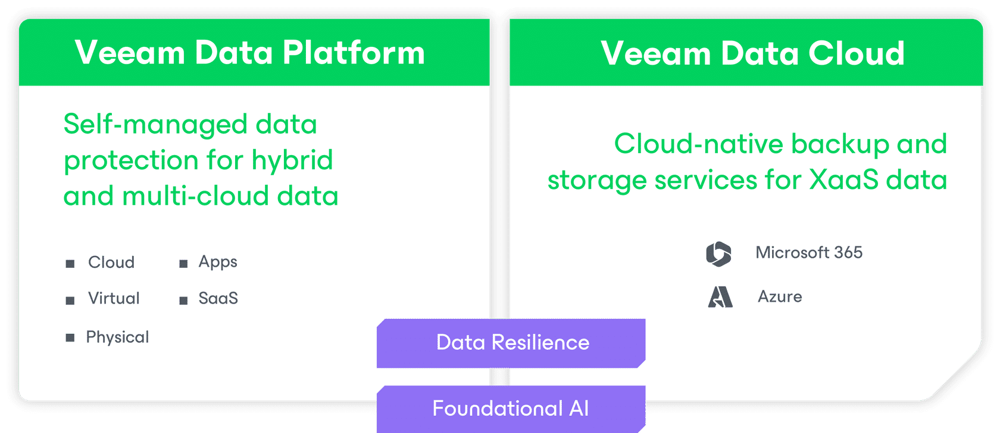
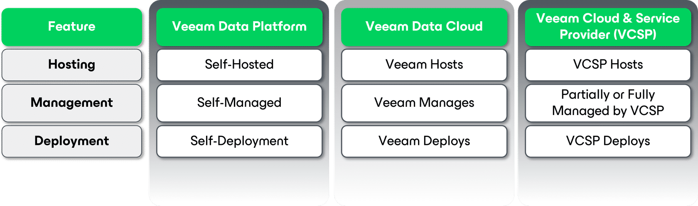
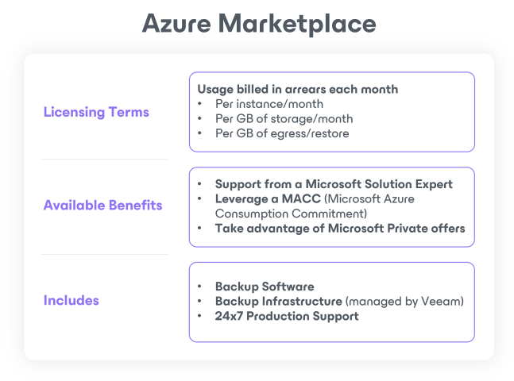

# Introduction to Veeam Data Cloud

Welcome: About this module

When you have completed this module, you will be ready to:

- Understand what Veeam Data Cloud is
- Explain the difference between Veeam Data Cloud and Veeam Data Platform
- Articulate the value proposition of Veeam Data Cloud

This learning module contains confidential information to be disclosed only to employees and third parties approved by Veeam.

## What is Veeam Data Cloud?

> It is so much easier to restore data using Veeam Data Cloud. Managing backups is so simple for us now. Low touch is a great benefit.
> - Darren Warner - Head of Technology, McGrath Estate Agents

Launched in 2024, **Veeam Data Cloud** is a comprehensive data management platform that offers seamless backup, recovery, and data governance for cloud, on-premises, and hybrid environments. It empowers organizations to protect and manage their data ensuring flexibility, scalability, and robust security.

- **VDC for Microsoft 365**
    - provides comprehensive backup and recovery solutions for Microsoft 365 applications, ensuring data protection and compliance.
- **VDC for Azure**
    - delivers robust data management and protection capabilities specifically designed for Azure workloads, enhancing security and availability.
- **VDC Vault**
    - serves as a secure cloud-based storage solution for backups, enabling organizations to store and manage their data with enhanced security and accessibility.

More workloads to come!

- **Confidence Without Complexity**
    - Cloud native design provides the best protection for your Microsoft 365 and Azure data, instantly ready out-of-the-box with policy driven simplicity.
- **Secure Architecture**
    - Using Zero-Trust based principles, the architecture is continuously updated and maintained for you, keeping your backups safe, secure and always ready for fast recovery.
- **All-in-one and Predictable**
    - All-in-one service includes backup software, infrastructure and storage, keeping costs low and predictable to stay on budget. 

## Veeam Data Cloud & Veeam Data Platform

> Software. check.
> Managed services. **check.**  
  
**Veeam Data Cloud** joins the **Veeam Data Platform** offering to cover users from **end to end**.

Let's take a closer look at the differences between Veeam Data Platform & Veeam Data Cloud

### Veeam Vault

Built on **Veeam Data Cloud** for **Veeam Data Platform** backups

**Secure cloud storage made easy with**:

- Predictable, all-inclusive pricing that eliminates bill shock
- Preconfigured Zero Trust security to safeguard data
- Fully managed cloud storage by experts
- Integration into **Veeam Data Platform** UI

**Up next**

Click **Continue** to learn about the Value Proposition for **Veeam Data Cloud**!

## Veeam Data Cloud Value Propositions

> #1 in Backup - Now as a Service for Microsoft 365 & Microsoft Azure

### Microsoft 365

Resilient Data Protection Made Simple for _Microsoft 365_.

NEW **Veeam Data Cloud for Microsoft 365** enables radical resilience for _Microsoft 365_ data, with a modern twist. The industry’s leading backup solution – **Veeam Backup for Microsoft 365** – is now delivered as a service by Veeam.

#### Trusted, industry-leading technology

The most comprehensive data protection solution with over a decade of continuous innovation built to scale

**Why it Matters:**

It’s essential to highlight that this solution is built on a mature and highly trusted product already recognized in the market. This foundation will help establish credibility and instill confidence in organizations considering its adoption.

#### Modern, secure and intuitive

Easily create backup jobs, complete restores, and gain Microsoft 365 insights from within a modern, web UI

**Why it Matters:**

Emphasizing the feature-rich, modern, and secure aspects of this solution will reinforce its value as a true 'as a service' cloud-hosted offering.

#### Everything is included

Software, backup infrastructure and unlimited storage bundled together with ongoing maintenance covered by the experts

**Why it Matters:**

Covering how this is packaged, with everything included, will not only give users a taste for what they get (and what they don’t have to manage), but also reinforces the simplicity of this solution.

### Microsoft Azure

Your data on Microsoft Azure is exposed to the same cyber threats and data loss as anywhere else, and it's your responsibility to protect it. But, in a world of never-ending priorities and spiraling cloud costs, properly protecting and securing your data on budget falls to the bottom of the to-do list - until now...

Veeam has the answer with its first SaaS offering powered by the industry's #1 data protection platform and experts. With just a few clicks, you can unlock a fully hosted and pre-configured solution that delivers proven, reliable backup and recovery to ensure business continuity and resiliency.

#### Value Proposition

- **Quick ROI**
    - Speed time to value by removing blockers like implementation, patching, and remediating misconfigurations.
- **Enterprise Readiness**
    - Leverage backup, security and FinOps best practices in a service.
- **Confident Recoverability**
    - Comprehensive, native protection with the most customizable RPOs and with automated backups and powerful recovery options in and out of cloud.

Now let's dig a little deeper into the supporting capabilities of these value propositions for Azure

##### Quick ROI

- **Easy Button Setup**
    - Deployed and pre-configured, removing time, staffing and resource constraints.
- **No patching or updates**
    - Always up to date with the latest features and security fixes, offloading ongoing maintenance to the experts.
- **Wizard-driven workflows**
    - An intuitive, automated and self-service UI empowers cloud teams to delegate secure access to common tasks.

##### Enterprise Readiness

- **Cloud cost optimization**
    - Customizable, policy-based storage tiering, compression and cost forecasting mitigates the risk of cloud overspend.
- **Cyber resilient**
    - Data integrity ensured with least privilege access to backups that are logically air-gapped, immutable and encrypted.
- **Actionable Insights**
    - Real-time monitoring offers proactive observability of backup job performance, unprotected data and more.

##### Confident Recoverability

- **SLA automation**
    - Simplified resource discovery to apply right-sized policies at scale to net new or existing Azure VMs, SQL databases and File Shares.
- **Azure-native backup**
    - Reliable BC/DR powered by the speed of native snapshots and the data loss avoidance of a true backup.
- **Flexible restore**
    - Full instances, folder and file-level recovery across regions and subscriptions to overcome data loss from accidental deletion to disaster.

## Packaging & Licensing

### Veeam Data Cloud for Microsoft 365 Packaging Options

> **PLEASE NOTE:** Any of these packages can be purchased and used independently or utilized in any combination deemed necessary by the customer to meet data protection requirements.

#### Express

Speed and scale —  powered by Microsoft 365 Backup Storage

Express is powered by Microsoft 365 Backup Storage, with the latest APIs offering:

- **Lightning-fast** backup and recovery capabilities
- **Bulk restores** at scale for increased resilience to ransomware or malware attacks.
- Microsoft’s backup solution is embedded inside Veeam’s Microsoft 365 Backup Service.
- Customers can protect these Microsoft 365 services with the Express package:
    - Exchange Online
    - SharePoint Online
    - OneDrive for Business

#### Flex

Control & flexibility with Veeam’s standard M365 BaaS offering _(Powered by Veeam Backup for M365)_

- Offering customers the control and flexibility they need to achieve their goals, all with the convenience of a BaaS solution.
- Is not integrated with Microsoft 365 Backup Storage.
- Customers will achieve traditional Microsoft 365 backup speeds, but have more options for control and flexibility compared to the Express package, including:
    - **Greater** **control** over the backup location, retention policies, and security
    - **Flexibility** with granular restores and advanced search capabilities         Support for Microsoft Teams

#### Premium

**Best of both**

- Customers can harness the capabilities of both through the **Premium package**
- Lead conversations with Premium to position the full breadth of capabilities for Veeam Data Cloud for Microsoft 365.
- Bundle of Express & Flex that can be managed under a single pane of glass
- **Recommended for all or identified top users,** with a hybrid of other packages for remaining users

**VCSPs**

- Please contact your VCSP Channel representative for more details on VCSP pricing
- You can find a fully vetted and verified competency partner for M365 on the Partner Directory on Veeam.com - [CLICK HERE](https://www.veeam.com/find-partner.html)

**For more information about Veeam Data Cloud, check out the** **Tool Kit on ProPartner.**

- [VDC Tool Kit](https://propartner.veeam.com/veeam-data-cloud/)

### Veeam Data Cloud for Microsoft Azure

Customers can license Veeam Data Cloud for Microsoft Azure on a monthly basis per user through the Azure Marketplace.

#### Licensing Terms

Usage billed in arrears each month

- Per instance/month
- Per GB of storage/month
- Per GB of egress/restore

#### Available Benefits

- Support from a Microsoft Solution Expert
- Leverage a MACC (Microsoft Azure Consumption Commitment)
- Take advantage of Microsoft Private offers

#### Includes

- Backup Software
- Backup Infrastructure (managed by Veeam)
- 24x7 Production Support

## Veeam Data Cloud FAQ

- How do I buy Veeam Data Cloud?
    - Veeam Data Cloud can be purchased through the Azure Marketplace or a Veeam-authorized Reseller. 
- Do I need to purchase a subscription upfront?
    - If you purchase the annual subscription^1, you will pay for the subscription upfront.
    - If you purchase a multi-year subscription^1, you have the option to pay upfront or pay on an annual basis. 
    - If you prefer a month-to-month subscription^2, you will pay upfront for the initial month. If there’s usage overage at the end of the month, you will be charged for that overage, and the next month will be set at the new subscription amount.
- Is support included in the price of Veeam Data Cloud?
    - Yes, 24x7 support is included in all Veeam Data Cloud purchases. 
- Does Veeam have public sector pricing?
    - Yes, Veeam provides special public sector pricing for Veeam Data Cloud for Microsoft 365, at a 10% discount compared to standard MSRP pricing.
- How does Veeam handle faculty/student or front-line worker licenses for Microsoft 365?
    - For the education sector, we offer highly competitive pricing of six free students for every paid faculty user, with a starting MSRP of $3.50 per user per month, and a minimum of 10 faculty users per order.
- How do I add users to an existing subscription?
    - It is easy to add users to your existing subscription as your business grows. Veeam Resellers have monthly co-term licenses available to add users and align with your existing subscription contract.

1: Annual and multi-year subscriptions are available for Veeam Data Cloud for Microsoft 365, with upfront or annual options available.

2: Month-to-month is available for both Veeam Data Cloud offerings, with payment billed in arrears after consumption is calculated each month. This aligns most closely with a true SaaS model. 

## Module summary

Congratulations!

You completed the Introduction to Veeam Data Cloud module!

**You should now be able to:**

- Understand what the Veeam Data Cloud is
- Explain the difference between Veeam Data Cloud and Veeam Data Platform
- Articulate the value proposition of Veeam Data Cloud

For further information, check out [Veeam.com](https://www.veeam.com/newsroom/cirrus.html)
