# The Veeam Opportunity

**Welcome: About this module**

Welcome to **The Veeam Opportunity**! Whether you are learning about Veeam for the first time, or you’ve been a partner for years, this learning stream is designed to help you maximize your earnings and become a trusted advisor to your customers.

Veeam is a channel first sales company — which means we empower our partners to build strong customer relationships and offer powerful solutions with cutting edge technology that scales to the environments and workloads your customers' demand. 

Throughout this learning stream, you’ll learn about the data management goals and challenges customers face and how Veeam is uniquely positioned to integrate as a complete solution into their infrastructure – physical, virtual and cloud.  Veeam accomplishes all of this by being simple, flexible, reliable and powerful for both the customers who use Veeam and the partners who sell it.  

**Veeam keeps businesses running!**

**When you have completed this module, you will be ready to:**

- **Describe the data management challenges customers face**
- **Describe how Veeam is uniquely positioned to integrate as a complete solution into their infrastructure — physical, virtual and cloud**

This learning module contains confidential information to be disclosed only to employees and third parties approved by Veeam.

## The Market Landscape

### What's driving the market?

#### Ransomware & Security

Ransomware and cybersecurity stand as crucial market trends. As cyberthreats rise, businesses must prioritize robust security measures to protect sensitive data, maintain trust, and ensure uninterrupted operations in the ever-changing tech environment.

#### Cloud

Gartner predicts that business organizations spending on public cloud computing will exceed 51% by 2025*. With many customers migrating to one or more clouds, many will explore an alternative virtual platform or the cloud. 

*Gartner’s 2022 - [Cloud Shift](https://www.gartner.com/en/newsroom/press-releases/2022-02-09-gartner-says-more-than-half-of-enterprise-it-spending)

#### Platform consolidation is key

Gone are the days of having multiple point solutions to solve individual issues. Customers now want consolidated solutions that solve end to end problems as it's too difficult and costly to manage each of those individual solutions.

#### Virtualization

On-premises virtualization continues to be relevant, but more and more organizations are considering alternatives, including alternate hypervisors, hybrid/public cloud and containers for their production workloads.

## The Veeam Opportunity

### Veeam's purpose

> Veeam powers data resilience to keep every business running

- Leah 20L2 20Video 20SHORT 202025.mp4

> Veeam is a *channel first* sales company. We empower our partners to build strong customer relationships and offer powerful solutions with cutting edge technology that scales to the environments and workloads your customers demand.  

> Veeam is *purpose-built for powering data resilience*.

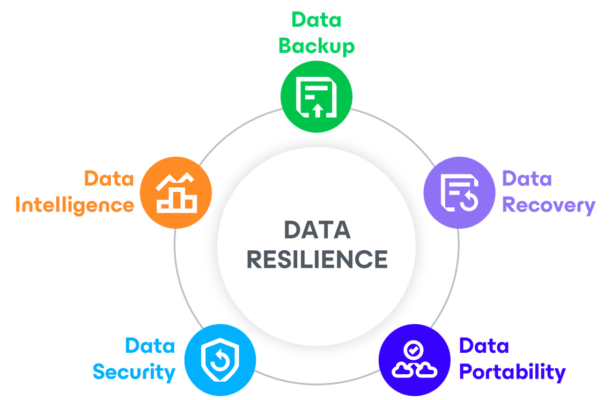

- Data Backup
    - Backup data is the first target of ransomware attacks 96% of the time. You have to make sure there is a clean, locked-down, immutable, air-gapped copy of your data to recover from.
- Data Recovery
    - Data Recovery is all about making sure that if your business is disrupted for whatever reason (cyber, regulation, human error, natural disaster), you can recover your data instantly, to anywhere, with no data loss, and without re-infection
- Data Portability
    - Data Portability is having the ability to freely move your data whenever, wherever, and however you want it, based on your business need and strategy. And making sure that your data is not locked-in with any one vendor, platform, technology, or physical/geographic location.
- Data Security
    - Data Security is about making sure your data is protected in a true zero trust architecture with secure, controlled access; many security table-stakes like MFA, E2E encryption; and proactive security measures like threat scanning.
- Data Intelligence
    - Data Intelligence is 3 things: Making our products better, deriving insights around your entire data estate AND making it easier and more effective for you.

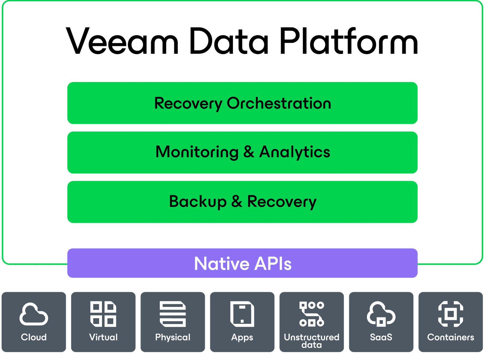

## Why Veeam and Why Now?

> Why Veeam?
> Deliver on customer outcomes to increase your profit margin
> Maximize your profit!

> Why sell Veeam? Because there is something in it for you! 
> Specifically, more revenue in your pocket!

### Veeam Data Platform

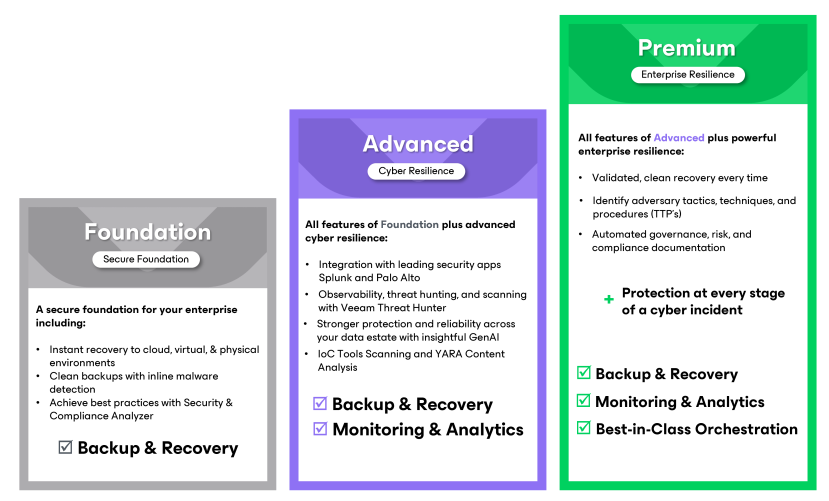

> Internal Reminder:  VDP does not include everything that Veeam offers. Microsoft 365, Kasten and Salesforce are all separate offerings, separate purchase.

> Remember: There is even extra revenue to grab on the RENEWALS side through possible SPIFFs and migration multipliers - reach out to learn more!

### Veeam Cyber Secure

**Veeam Cyber Secure** is an elite, optional program to help security-first customers follow best practices for implementation and ongoing management of their backups to protect **before, during, and after** a cyber incident. This unique offering includes a world-class incident response retainer delivered by **Coveware by Veeam** to help make sure your organization is prepared – no matter what the world throws at you.

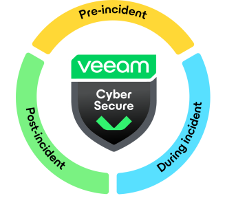

#### Pre-Incident

**Ensure your Veeam environment is secure and optimized with our offerings:**

- Advanced onboarding support
- Architectural design and implementation services
- Quarterly and yearly security assessment checks
- Priority support cases routing by Veeam’s SWAT support team and dedicated Support Account Manager
- Personalized training, including quarterly tactics, techniques, and procedures (TTPs) analysis sessions

#### During Incident

**In the event of a ransomware attack, you’ll have:**

- Expert Incident Response from Coveware by Veeam
- 24/7/365 support with a 15-minute response SLA
- Patent-pending technology for assessment (Recon Scanner)
- Coordinated expertise for forensic triage, negotiation, and decryption

#### Post-Incident

**With Veeam Cyber Secure, you get:**

- Available ransomware recovery warranty for up to $5 million
- Post-incident and insurance documentation

### Why Now?

#### Radical Resilience

| Organizations                                            | Targets                                         | Affected                                        |
| -------------------------------------------------------- | ----------------------------------------------- | ----------------------------------------------- |
| 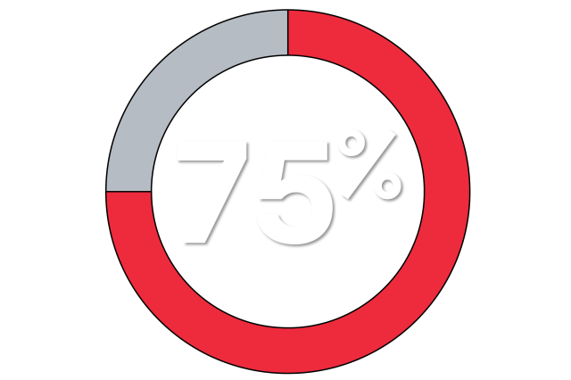                           | 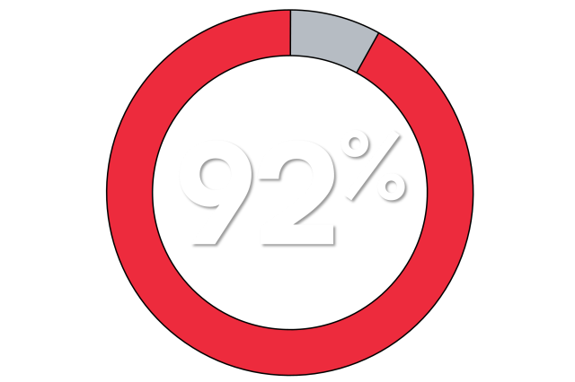 | 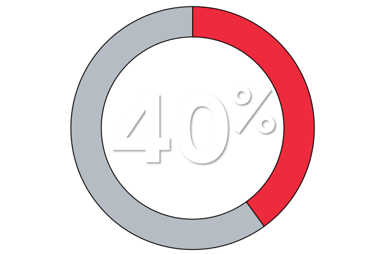                   |
| of organizations were hit by a ransomware attack in 2024 | of ransomware attacks targeted backups          | of production data was affected by cyber attack |

> Cybercriminals are getting smarter and are specifically targeting backups.
> We'll learn more about this later in this curriculum.

> **When you can’t recover, you go out of business.**

At **Veeam**, we take the notion of **“last line of defense”** even further and believe that **backup** is your **BEST line of defense.**

Achieve **radical resilience** that can only come from complete confidence in your **protection**, **response**, and **recovery**.

**Veeam Data Platform** **provides the confidence you need to take a** **stand** **against cyberattacks.**

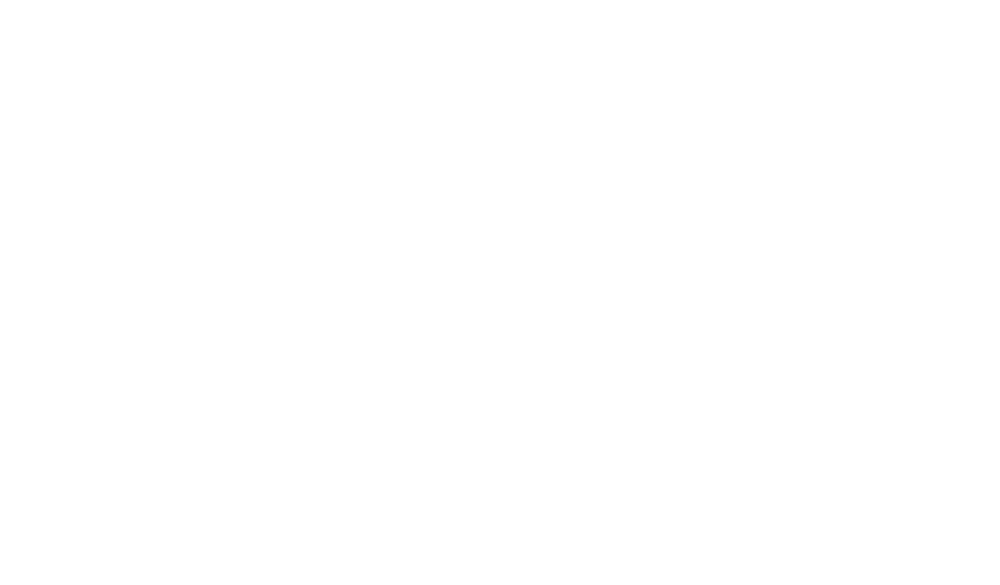

## Working with Veeam

> Everything we do has partners in mind!
> YOUR success is OUR mission.

### Channel first

Veeam is a channel first organization. Our sales reps may build opportunities and then move it to the channel or vice-versa, but Veeam's sales reps and engineers partner with YOU to support you as needed.

### Partner first

Because we are a channel first sales company, everything we do is with partners in mind — first and foremost. We align with **YOUR** sales team's process to give you the tools and support you want and need to create solutions for your customers and close deals.

We know you do not need us to be directly involved with every sale. We are there when you need us! We can assist with proof-of-concepts, demos, alliance integrations, licensing options and other facets of your sale that may require a more hands-on approach. We can recommend flexible universal licensing options to maximize operating and capital expenses.

Veeam is your trusted advisor! We enable you to sell larger deals and sell more on your own, while always being there when you need us.

### A new era in partnership

Partners are now partnering with other partners! That’s right, technology partners are partnering with other technology partners to offer an entire solution to their customer. One partner’s niche may be SaaS, another may be services, and so on.

**According to Accenture,** **76%** **of CEOs think the current business model will be** **unrecognizable** **in five years. They see partnerships and ecosystems as the way of the future.**

**There’s good news! Veeam can help you modernize your channel business model.**

The **Pro**Partner Network is a robust global ecosystem of partners that work directly and indirectly with one another to build, market and sell Veeam solutions and Veeam-powered services. When partners join the **Pro**Partner Network, they have access to customized programs, tools and resources designed to enable our partners to become more profitable and drive growth. 

Today, the **Pro**Partner Network consists of the partner types shown to the right.

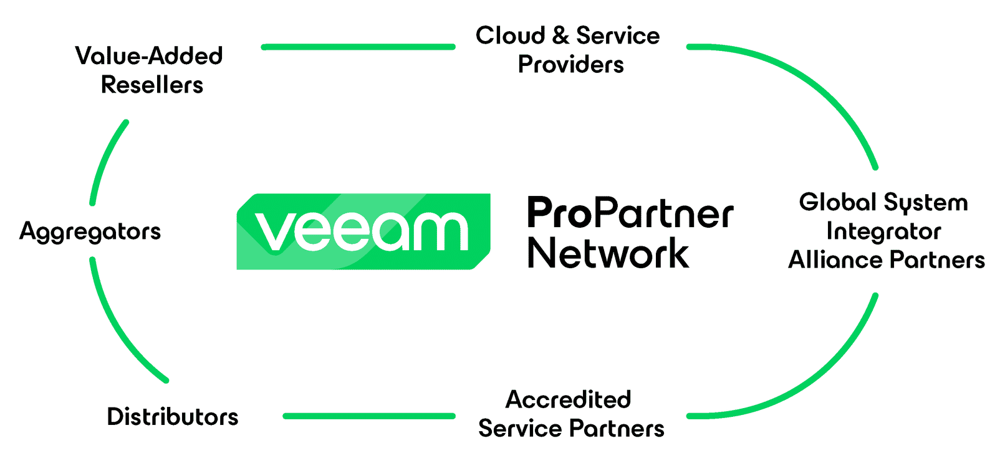

### Customer expansion

Veeam can grow your customers' environments as they grow and become more complex.

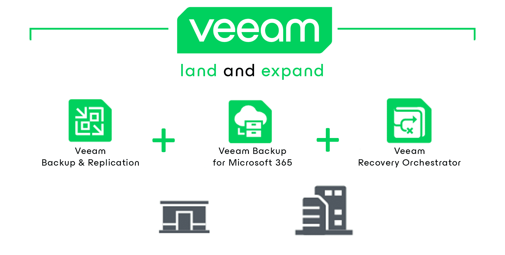

A customer may start with **Veeam Data Platform - Foundation** for their on-premises workloads and upgrade to **Veeam Data Platform - Advanced Edition** if they decide to start using Microsoft 365 and require in-depth protection monitoring. Then, they may decide to automate workload recovery in an expanded environment with Veeam Recovery Orchestrator, included in **Veeam Data Platform – Premium.**

Veeam adapts and aligns to modern market trends, offering different licensing models from CapEx to OpEx, enabling customers to choose their preferred strategy towards Digital Transformation and their journey to the cloud.

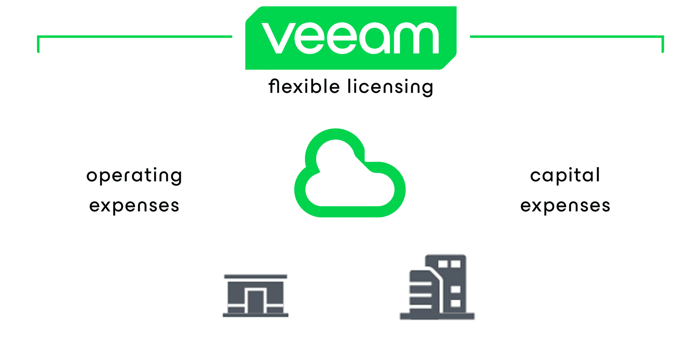

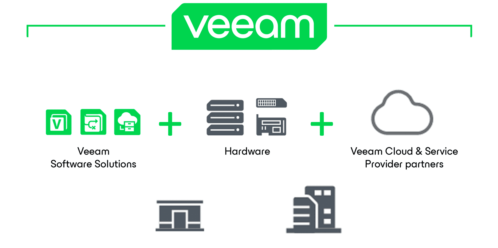

The best deals with the most margin potential position Veeam as an essential component of a customer's holistic data management solution, growing the customer over time. 

**Veeam is a complete solution package!**

Combine our software solution with any hardware sales and deliver on customer outcomes to **increase your profit margin.** Maximize this benefit through our **Pro**Partner programs.

_Continue on to learn more details about our **Pro**Partner programs._

## Alliances

> Veeam and our **Alliance partners** enable powerful integrations, that deliver robust, reliable,  industry-leading data protection solutions, optimized for customers' environment of choice.

## Alliance Partners + Veeam

- **Powerful integrations**
- **Industry-leading solutions**
- **Optimized for customers' environment**

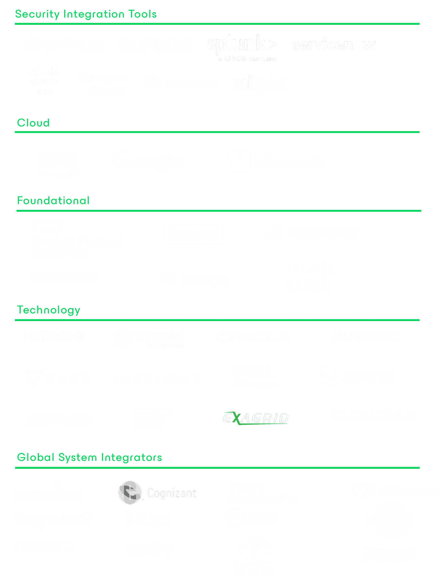

Through these relationships, Veeam can offer powerful integrations with our alliance partners, which strengthen a customer's total solution. The power and reliability of Veeam coupled with companies like HPE, Pure, or Microsoft, ensures customers receive the highest level of infrastructure optimization and support.

Veeam has a robust alliance ecosystem.  We will never try to persuade you to work with a particular alliance partner. We simply demonstrate the abilities and functionality we have with the alliance  your customers select. 

Partners can choose what hardware and service providers make sense for their customer at any given time without losing access or support from Veeam. **That's the value of joint solutions with Veeam!**

### Alliance Partners + Veeam

#### Security Partner

These Alliance partners integrate Veeam data protection events into their security tooling, providing visibility of Veeam Data Platform and backups to the cybersecurity teams. These alliances integrate IT and Operations with Security teams.

#### Cloud Partners

These are Alliance Partners offering cloud-native solutions or support for key enterprise class workflows only running in the cloud. Veeam paired with Cloud Alliance Partner offerings means that customers can easily protect and manage their data as they continue their cloud journey and can migrate workloads to and from the cloud.

#### Foundational Partners

These are Alliance Partners that have both a technology and commercial relationship with Veeam to help with everything from deployment to ongoing sales support resolution. Customers benefit from tightly integrated solutions that are jointly engineered to decrease time to market via pre-vetted solutions based on optimized configurations and best practices.

#### Technology Partners

ISV Alliance Partners offer complementary technology that, when paired with Veeam, creates a more robust customer solution. We partner with ISVs in areas such as key enterprise applications, governance and compliance, and solutions specializing in key enterprise use cases.

#### Global System Integrators

These are organizations who specialize in helping customers with transformational solutions through in-house practice expertise. Whether your solution is deployed on-prem or outsourced, protecting and managing your data is crucial to the success of your transformation project.

#### Summary

Veeam and our Alliance Partners enable powerful integrations and industry-leading data protection solutions optimized for customers environment of choice.

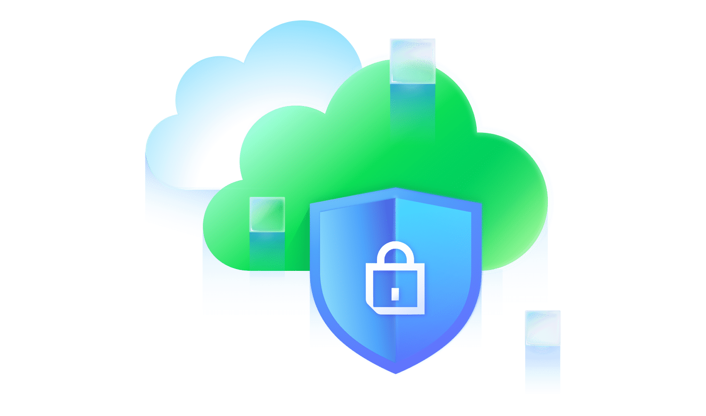

## Badge overview

> **Veeam Sales Professional** (VMSP) badge will help accelerate your business!

You've completed your first step toward completing the **VMSP** Badge!

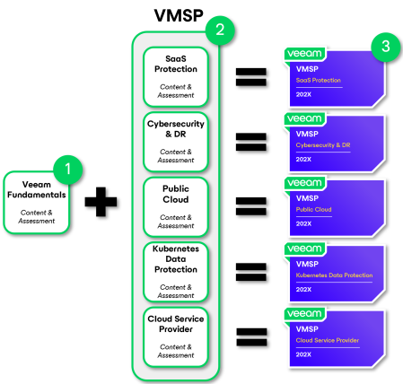

### VMSP badge overview

1. Complete all the modules and review all the resources within the Veeam Fundamentals Learning Stream.
2. Then, choose your next Learning Stream and complete all the modules and review all the resources within the Learning Stream.
3. Earn a badge for completing each additional Learning Stream!

You can take all the Learning Streams offered but **only Veeam Fundamentals + one additional Learning Stream is required to earn a VMSP badge.** In total, it should take about one hour to complete the badge requirements.

> Remember to visit the **Pro**Partner portal for the latest tools and resources!

## Knowledge check

Before you conclude this module, if you would like, please answer the following **optional** questions to help reinforce your understanding of this module.

> [!NOTE]
> What are the **5 pillars** that make Veeam purpose build for powering data resilience?
> 
> _(Select all that apply)_
> 
> - [x] Data Backup
> - [x] Data Intelligence
> - [ ] Data Agnostic
> - [x] Data Security
> - [x] Data Portability
> - [x] Data Recovery

> [!NOTE]
> What advantages does the integration of Vault into the Veeam Data Platform provide for cloud storage solutions?
> 
> _Select the best option._
> 
> - [x] It simplifies secure cloud storage management and eliminates infrastructure headaches.
> - [ ] It requires extensive infrastructure management and custom cost modeling.
> - [ ] It only supports physical data without cloud capabilities.
> - [ ] It limits data protection to on-premises environments only.

> [!NOTE]
> How many ransomware attacks targeted backups in 2024?
> 
> _Select the best option._
> 
> - [ ] 40%
> - [ ] 75%
> - [x] 92%

## Module summary

Congratulations!

You have completed **The Veeam Opportunity** module!

**You should now be able to:**

- Describe the data management challenges customers face
- Describe how Veeam is uniquely positioned to integrate as a complete solution into their infrastructure — physical, virtual and cloud
