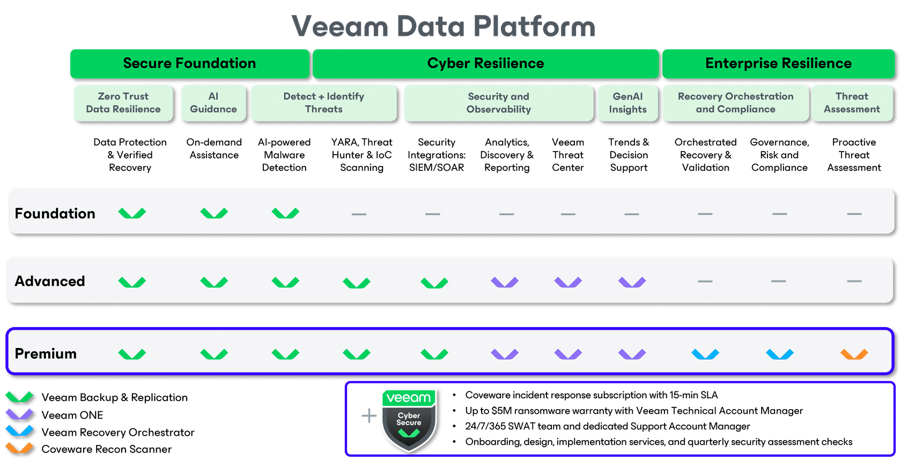
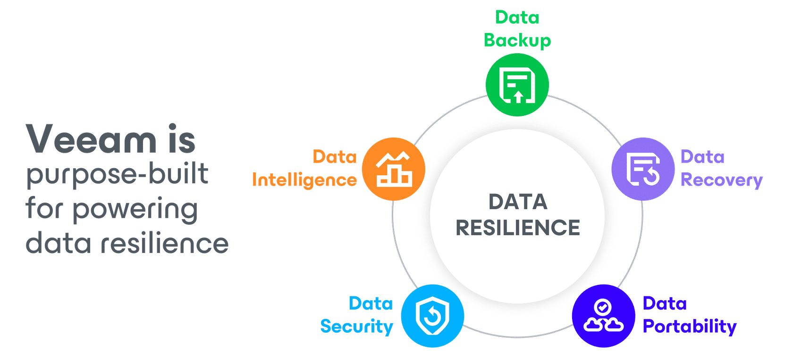

# Veeam Fundamentals

**In this module, you'll learn about:**

- The challenges customers face when keeping their businesses running.
- How the Veeam® Data Platform solves these challenges.
- The 3 platform editions available to support business continuity using Veeam Data Platform

You will learn more about each core product in the other modules in this learning path, but let's get started here!

This learning module contains confidential information to be disclosed only to employees and third parties approved by Veeam.

## Data resilience challenges

> Data resilience is harder than it needs to be.

- Expanding hybrid cloud workloads
- Growing infrastructure complexity
- Time consuming manual processes
- Increasing cyberthreats

> **Outages and data loss** are an unfortunate reality.

- 75% of organizations were hit by a ransomware attack in 2024*
- 92% of ransomware attacks targeted backups*
- 40% of production data was affected by cyberattack*

**Source:** Veeam 2024 Ransomware Trends & Data Trends Reports

- In 2024, **75%** of organizations were hit by a ransomware attack. This is an increase in comparison to the year prior. 2/3 of those organizations were hit more than once. 
- Of those attacks, **40%** of production data was affected which would mean you need to recover almost HALF of your data!

> **Cybercriminals are also getting smarter and are specifically targeting backups.**

- In our 2024 Ransomware Trends report we saw that **92%** of ransomware attacks targeted backups – **with 75% being at least partially successful.**

> When you can’t recover, you go out of business.

**Compromised backups have a huge impact.**

When your primary data and your backups are encrypted or destroyed during an attack, you can’t recover.

**The need for Data Resilience now feels more pressing than ever.**

## Introduction: Veeam Data Platform

### Veeam Data Platform: Keeps Businesses Running

- **Backup & Recovery**
    - Backup and recovery is critical, but it’s just not enough anymore to effectively respond to the ever-growing threats of cyberattacks. Having advanced capabilities to monitor and measure protection, while automating and orchestrating data recovery is PARAMOUNT to achieving resilience.
- **Resiliency**
    - Veeam provides organizations with data resiliency through secure backup - and fast, reliable recovery solutions for their hybrid cloud. We integrate seamlessly with AWS, Azure and Google Cloud, and we offer native backup and application mobility for Kubernetes. 
    - Additionally, you can protect Microsoft 365 and Salesforce data to get the recovery flexibility you need with separate purchase.
- **Lead with Premium**
    - Advanced and Premium provide organizations with strong resilience against cyberattacks at enterprise scale.

### Enterprise Resilience

> _Premium_  
> **Unleash enterprise-class data resilience**

#### Automated testing

- **Automated Docs**  
- **Proven Compliance**  
- SLA readiness, automated testing, and documented compliance

#### Guided Recovery

- **Integrated Response**  
- **Know before you go**  
- Trusted advisor leading end-to-end ransomware response and recovery

#### Orchestrate to Win

- **Automate Clean**  
- **Recovery**
- Scalable orchestrated recovery tailored to your business: recover clean, every time

### Secure Foundation

> _Foundation_  
> **Keep your data safe and under your control**

#### Secure backup

- **Instant Recovery**  
- **Breadth of Support**  
- Business protection across entire hybrid data estate

#### Immutability

- **Lifecycle control**  
- **Automated Testing**  
- Keep data safe and immutable across the entire lifecycle

#### Policy Based

- **Manage Retention**  
- **Compliance Report**
- Automated policy-based data backup and retention across environments

### Cyber Resilience

> _Advanced_
> **Defend your data with unwavering cyber resilience**

#### Malware Detection

- **Signature Scan**  
- **Secure Restore**  
- AI-powered malware detection and proactive threat hunting

#### Incident API

- **Activity Reporting**
- **Security Score**
- Uncover malicious activity and respond immediately

#### Secure Console

- **Deletion Protection**  
- **MFA**
- Keep backups safe from unauthorized access, encryption, or deletion

> Veeam keeps businesses running with **Data Security,** **Data Portability,** **Data Intelligence,** **Data Recovery,** **and** **Data Backup**

- **Data Security:** Making sure your data is protected in a true zero trust architecture with secure, controlled access; many security table-stakes like MFA, E2E encryption; and proactive security measures like threat scanning.
- **Data Portability**: Having the ability to freely move your data whenever, wherever, and however you want it, based on your business need and strategy. And making sure that your data is not locked-in
- **Data Intelligence**: Comprised of 3 things, making our products better, deriving insights around your entire data estate AND making it easier and more effective for you
- **Data Recovery**: All about making sure that if your business is disrupted for whatever reason (cyber, regulation, human error, natural disaster), you can recover your data instantly, to anywhere, with no data loss, and without re-infection
- **Data Backup:** Backup data is the first target of ransomware attacks 92% of the time. You have to make sure there is a clean, locked-down, immutable, air-gapped copy of your data to recover from.

## Veeam Data Platform Updates

### Detect And Identify Cyberthreats

- Early threat detection
    - AI-powered built-in Malware Detection Engine performs low-impact inline entropy and file extensions analysis during backup for immediate detection
- Proactive threat hunting
    - Backup anomalies are instantly reported into ServiceNow and other SIEM tools of your choice so you can immediately perform triage and reduce further risk to your data
- Get a second opinion
    - Let your cyber-threat tool report infections directly into the Veeam Incident API, marking existing restore points as infected or trigger backup

### Respond and recover faster from ransomeware

- Avoid reinfection
    - YARA content analysis helps to pinpoint identified ransomware strains to prevent reintroduction of malware into your environment
- Automate clean recovery
    - Perform orchestrated recovery of an entire environment using malware-free restore points
- Recover with precision
    - Perform point-in-time recovery to the moment prior to infection with the I/O Anomaly Visualizer, ensuring the lowest possible data loss thanks to Veeam CDP

### Secure And Compliant Protection For Your Data

- Guarantee survival
    - Prevent accidental or malicious deletion or encryption of backups by employing a zero-trust architecture, “Four-eyes” admin protection and immutable backups
- Verify security & compliance
    - Ensure recovery success with automated scans using the Security & Compliance Analyzer, leveraging infrastructure hardening and data protection best practices
- Put the spotlight on malware
    - Highlight threats, identify risks and measure the security score of your environment in the Veeam Threat Center

## Packaging: Platform editions

> **_Also available:_** _Veeam Data Platform —  Essentials Edition for Small Business_

### Supporting platform components

Veeam Data Platform Packages are supported by four core product components with four distinct outcomes:

- **Veeam Backup & Replication**
    - Backup & Recovery
- **Veeam ONE**
    - Monitoring & Analytics
- **Veeam Recovery Orchestrator**
    - Recovery Orchestration
- **Veeam Threat Hunter**
    - Proactive Threat Assessment

In the following courses, you'll **learn more about each of these product components** and how to talk to customers about them.

## Module completion

**You've reached the end of this module!**

**Want to learn more?**

Be sure to check out the additional resources that are available within your learning platform!
