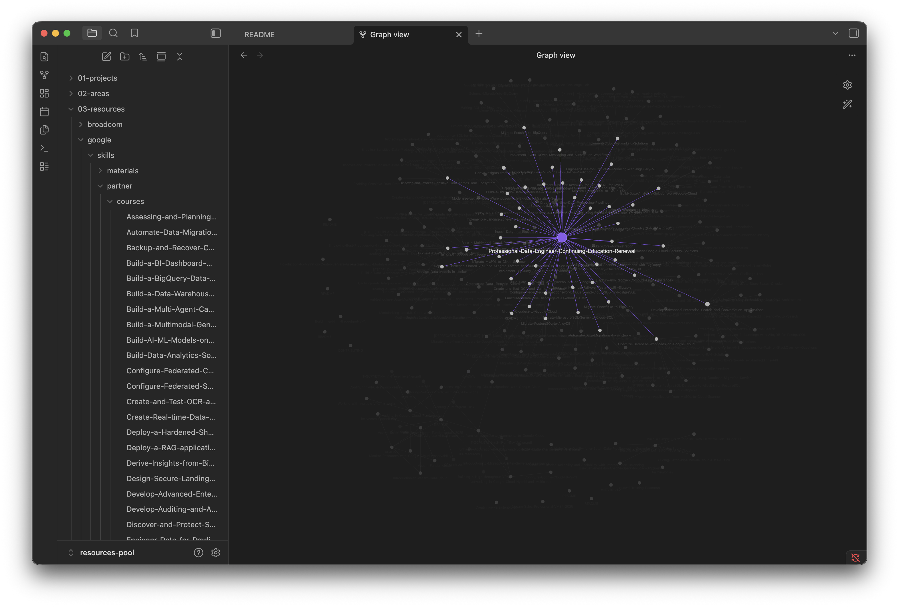
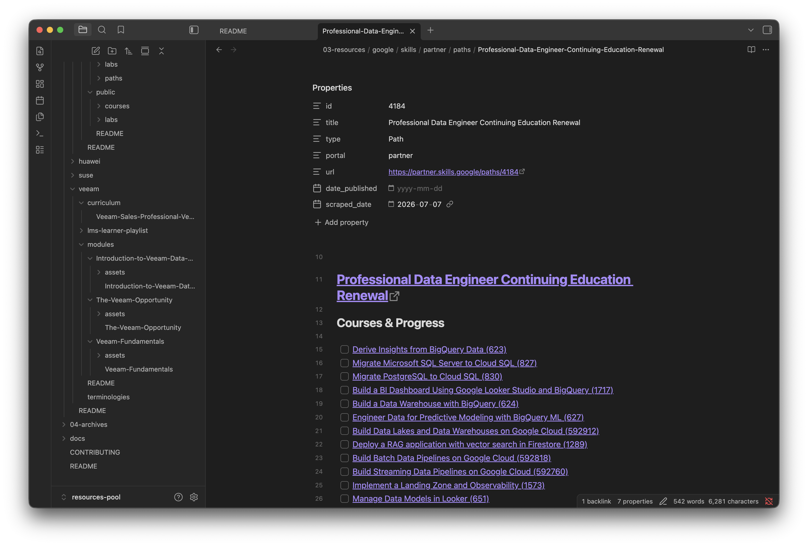

# Resource Pool

- PARA Model
- [The PARA Method: The Simple System for Organizing Your Digital Life in Seconds](https://fortelabs.com/blog/para/)
- [The PARA Method](https://www.buildingasecondbrain.com/para)

Structure:

- [01-projects](01-projects)
    - Where your projects stored and tracked. 
- [02-areas](02-areas)
    - Areas you're working in.
- [03-resources](03-resources)
    - Resources that are referred to by your projects or areas.
- [04-archives](04-archives)
    - Projects/Areas or even Resources can be archived (NOT DELETE) here.

## 01 Projects

## 02 Areas

## 03 Resources

- [google](03-resources/google/README.md)
- [suse](03-resources/suse/README.md)
- [veeam](03-resources/veeam/README.md)

## Vault - PKB

Graph:

Path:

